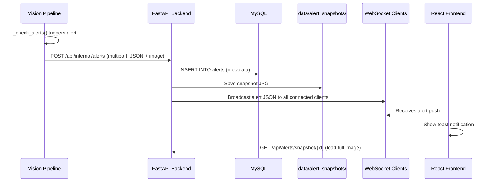
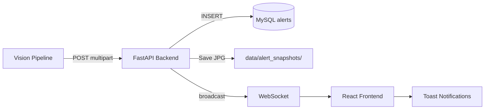
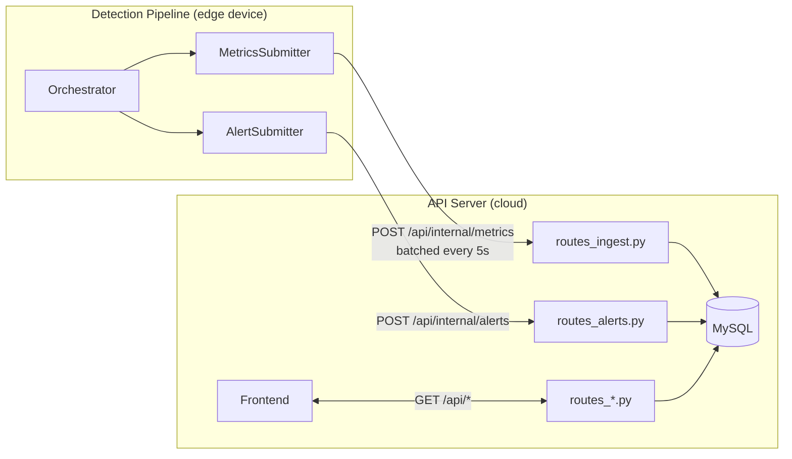

#GRANITE

![[Proposed Architecture 2026-02-20 16.27.54.excalidraw|1000]]

## Alerting Pipeline

###  Sequence Diagram

```mermaid
sequenceDiagram
    participant VP as Vision Pipeline
    participant API as FastAPI Backend
    participant DB as MySQL
    participant FS as data/alert_snapshots/
    participant WS as WebSocket Clients
    participant FE as React Frontend

    VP->>VP: _check_alerts() triggers alert
    VP->>API: POST /api/internal/alerts (multipart: JSON + image)
    API->>DB: INSERT INTO alerts (metadata)
    API->>FS: Save snapshot JPG
    API->>WS: Broadcast alert JSON to all connected clients
    FE->>WS: Receives alert push
    FE->>FE: Show toast notification
    FE->>API: GET /api/alerts/snapshot/{id} (load full image)
```

### Data Flow

```mermaid
graph LR
    VP[Vision Pipeline] -->|POST multipart| API[FastAPI Backend]
    API -->|INSERT| DB[(MySQL alerts)]
    API -->|Save JPG| FS[data/alert_snapshots/]
    API -->|broadcast| WS[WebSocket]
    WS --> FE[React Frontend]
    FE --> Toast[Toast Notifications]
```

## Modified Data access , limited to API server only

```mermaid
graph LR
  subgraph "Detection Pipeline (edge device)"
    O[Orchestrator] --> MS[MetricsSubmitter]
    O --> AS[AlertSubmitter]
  end
  subgraph "API Server (cloud)"
    MS -->|"POST /api/internal/metrics<br/>batched every 5s"| IG[routes_ingest.py]
    AS -->|"POST /api/internal/alerts"| AL[routes_alerts.py]
    IG --> DB[(MySQL)]
    AL --> DB
    FE[Frontend] <-->|"GET /api/*"| RO[routes_*.py]
    RO --> DB
  end
```
