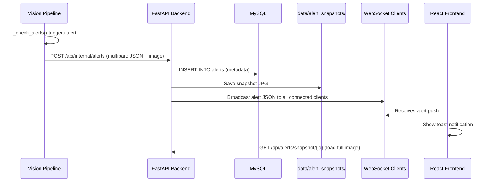

# Real-Time Alert Notification System (Revised)

The vision pipeline and FastAPI backend are **separate processes**. The pipeline will call an **internal HTTP endpoint** on the backend to submit alerts. The backend persists them to MySQL, saves snapshot images to a protected folder, and broadcasts to WebSocket clients in real time.

## Architecture



---

## User Review Required

> [!IMPORTANT]
> **Internal API security:** The `POST /api/internal/alerts` endpoint is meant for the pipeline process only. We'll protect it with a simple shared secret token in an `X-Internal-Token` header, configurable in [config.yaml](file:///d:/Boulder/config/config.yaml). This keeps it inaccessible from the frontend.

> [!NOTE]
> **Separate process in pipeline:** The HTTP POST (sending image + JSON) is done in a **background process** via `multiprocessing.Process(daemon=True)` so it never blocks frame processing and is fully GIL-independent. Each alert spawns a short-lived fire-and-forget process.

---

## Proposed Changes

### MySQL Alert Table

#### [MODIFY] [time_series_db.py](file:///d:/Boulder/src/storage/time_series_db.py)

Add `CREATE_ALERTS_TABLE` SQL and new methods:
```sql
CREATE TABLE IF NOT EXISTS alerts (
    id BIGINT AUTO_INCREMENT PRIMARY KEY,
    alert_id VARCHAR(128) UNIQUE NOT NULL,
    timestamp DOUBLE NOT NULL,
    recorded_at DATETIME DEFAULT CURRENT_TIMESTAMP,
    level VARCHAR(16) NOT NULL,
    source VARCHAR(64) NOT NULL,
    message TEXT NOT NULL,
    data_json TEXT,
    snapshot_filename VARCHAR(256),
    acknowledged BOOLEAN DEFAULT FALSE,
    INDEX idx_alert_timestamp (timestamp)
) ENGINE=InnoDB;
```

New methods:
- `insert_alert(alert_id, timestamp, level, source, message, data_json, snapshot_filename)` — direct insert (no buffering, alerts are infrequent)
- `query_alerts(limit, acknowledged)` — return recent alerts
- `acknowledge_alert(alert_id)` — mark as acknowledged

---

### Pipeline Alert Submitter

#### [NEW] [alert_submitter.py](file:///d:/Boulder/src/alerts/alert_submitter.py)

A lightweight class used by the orchestrator to POST alerts to the backend:
- `AlertSubmitter.__init__(api_url, token)` — stores the internal API URL and auth token
- `AlertSubmitter.submit(alert, snapshot_frame)` — encodes the frame as JPEG, fires a `multiprocessing.Process(daemon=True)` to POST multipart form data (`alert_json` + `image` file) to `/api/internal/alerts`
- Non-blocking: the process is daemon, errors are logged but never crash the pipeline

#### [MODIFY] [orchestrator.py](file:///d:/Boulder/src/pipeline/orchestrator.py)

- In [_initialize_components()](file:///d:/Boulder/src/pipeline/orchestrator.py#218-298): create an `AlertSubmitter` instance from config
- In [_run_loop()](file:///d:/Boulder/src/pipeline/orchestrator.py#329-477): after triggering alerts, call `submitter.submit(alert, display_frame)` to send the alert + current frame with overlays to the backend

#### [MODIFY] [config.yaml](file:///d:/Boulder/config/config.yaml)

Add under `alerts:`:
```yaml
alerts:
  # ... existing settings ...
  api_url: "http://localhost:8000"
  internal_token: "crusher-internal-secret"
```

---

### FastAPI Alert Endpoints

#### [NEW] [routes_alerts.py](file:///d:/Boulder/src/api/routes_alerts.py)

New router with three groups:

**Internal (pipeline → backend):**
- `POST /api/internal/alerts` — receives multipart (JSON + image), validates token, inserts into DB, saves image to `data/alert_snapshots/`, broadcasts to WebSocket clients

**Public (frontend → backend):**
- `GET /api/alerts/history?limit=20` — returns recent alerts from DB
- `GET /api/alerts/snapshot/{filename}` — serves snapshot images via `FileResponse`
- `POST /api/alerts/{alert_id}/acknowledge` — marks alert as acknowledged
- `WebSocket /api/ws/alerts` — clients connect to receive real-time alert pushes

**WebSocket connection manager** (in same file):
- Tracks active connections in a set
- `broadcast(message)` sends to all connected clients
- Handles disconnects gracefully

#### [MODIFY] [app.py](file:///d:/Boulder/src/api/app.py)

- Import and include `alerts_router`
- Ensure `data/alert_snapshots/` directory is created on startup

---

### Frontend Toast Notifications

#### [NEW] [useAlertSocket.ts](file:///d:/Boulder/frontend/src/hooks/useAlertSocket.ts)

React hook:
- Opens WebSocket to `ws://localhost:8000/api/ws/alerts`
- Auto-reconnect with exponential backoff (1s → 2s → 4s → max 30s)
- On connect, fetches `/api/alerts/history` for catch-up
- Returns `{ alerts, dismissAlert, acknowledgeAlert, isConnected }`

#### [NEW] [AlertToast.tsx](file:///d:/Boulder/frontend/src/components/AlertToast.tsx)

Fixed-position toast stack in the **top-right corner** (visible on all pages):
- Each toast: severity icon + color bar, message, relative timestamp, snapshot thumbnail
- Click thumbnail → opens full-size snapshot in a modal overlay
- "Acknowledge" button → calls `POST /api/alerts/{id}/acknowledge`
- Auto-dismiss after 30s, or manual dismiss
- Slide-in animation, color coding: CRITICAL=red, WARNING=amber, INFO=blue

#### [NEW] [AlertToast.css](file:///d:/Boulder/frontend/src/components/AlertToast.css)

Styles with glassmorphism, slide-in animation, responsive stacking.

#### [MODIFY] [api.ts](file:///d:/Boulder/frontend/src/types/api.ts)

Add `AlertNotification` interface.

#### [MODIFY] [App.tsx](file:///d:/Boulder/frontend/src/App.tsx)

Render `<AlertToast />` at root level (outside routes) using the `useAlertSocket` hook.

---

## Verification Plan

### Automated Tests

```bash
# 1. DB table creation + alert insert/query/acknowledge
python -m pytest tests/test_alerts.py -v

# 2. Internal POST endpoint + WebSocket + history endpoint
python -m pytest tests/test_api.py -v -k "alert"

# 3. Existing API tests still pass
python -m pytest tests/test_api.py -v

# 4. Frontend compiles cleanly
cd frontend && npm run build
```

### Manual Verification

1. Start API server → open frontend → verify WebSocket connects (check browser console)
2. Use `curl` to POST a test alert to `/api/internal/alerts` with a sample image
3. Verify toast appears in the frontend with the correct message and snapshot
4. Click "Acknowledge" → verify DB row updates
5. Refresh page → verify alert history loads on reconnect
